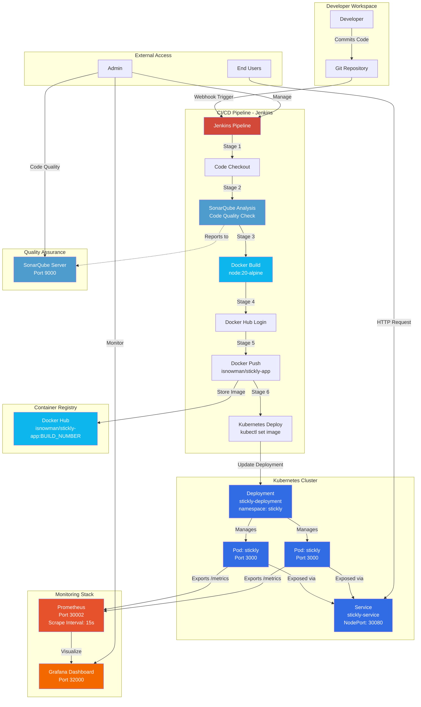

# DevOps Architecture Diagram

## Pipeline Stages

1. **Checkout**: Fetch latest code from Git repository
2. **SonarQube Analysis**: Run code quality and security analysis
3. **Docker Build**: Build container image using node:20-alpine
4. **Docker Login**: Authenticate with Docker Hub
5. **Docker Push**: Push image to registry with build number tag
6. **Kubernetes Deploy**: Update deployment and rollout to cluster

## Key Components

- **Jenkins**: CI/CD orchestration (Port 8080)
- **SonarQube**: Code quality analysis (Port 9000)
- **Docker Hub**: Container registry (isnowman/stickly-app)
- **Kubernetes**: Container orchestration
- **Prometheus**: Metrics collection (Port 30002)
- **Grafana**: Metrics visualization (Port 32000)

## Ports Summary

- Application: 30080 (NodePort)
- Jenkins: 8080
- SonarQube: 9000
- Prometheus: 30002
- Grafana: 32000
