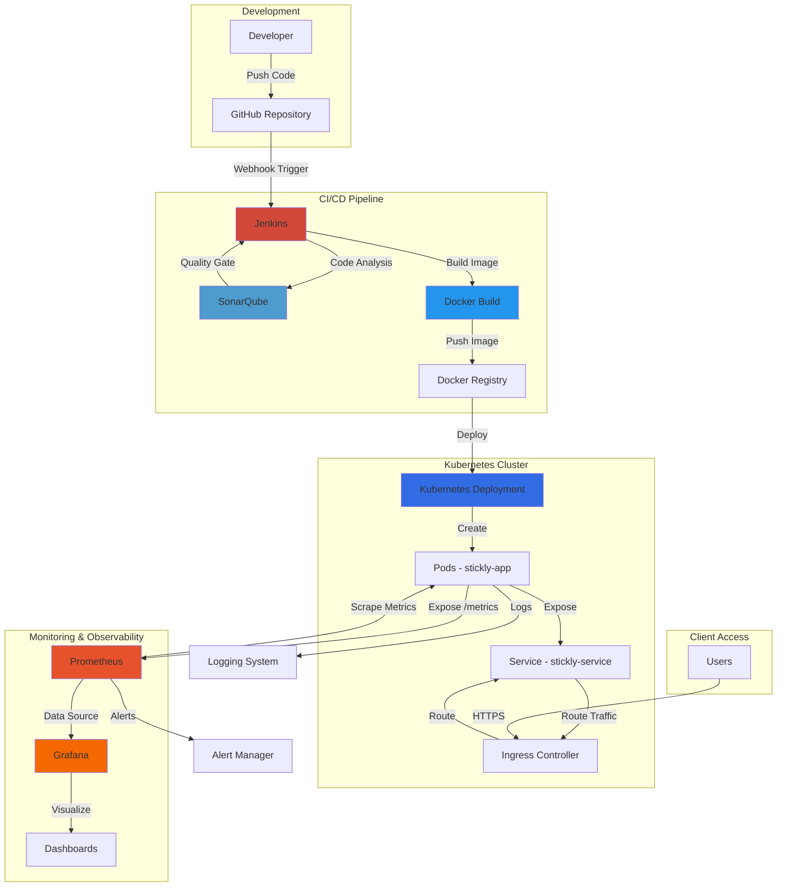

# Stickly 💬

> **Your secrets are safe here**

A modern, feature-rich anonymous message board where users can share their thoughts, knowledge, and confessions with the world. Built with a sleek Apple-inspired design featuring smooth animations, likes/reactions, search functionality, and a fully responsive interface optimized for all devices.


## 🌐 Service Ports & URLs

| Service | Port | Local URL | Description |
|---------|------|-----------|-------------|
| **Application** | 3000 | http://localhost:3000 | Main web application |
| **Prometheus Metrics** | 3000 | http://localhost:3000/metrics | Application metrics endpoint |
| **Prometheus Server** | 9090 | http://localhost:9090 | Prometheus query interface |
| **Grafana Dashboard** | 3001 | http://localhost:3001 | Metrics visualization |
| **Jenkins** | 8080 | http://localhost:8080 | CI/CD pipeline |
| **SonarQube** | 9000 | http://localhost:9000 | Code quality dashboard |
| **Kubernetes API** | 6443 | - | K8s cluster API server |

## ✨ Features

### Core Functionality

#### 📝 Message Management
- **Anonymous Posting** - Share messages without revealing your identity
- **Message Editing** - Edit messages within 5 minutes of posting with countdown timer
- **Edit History Tracking** - Complete audit trail of all message modifications
- **Edited Badge** - Visual indicator showing when messages have been modified
- **Image Support** - Upload images via file input or paste image URLs
- **Base64 Encoding** - Efficient serverless-compatible image storage
- **Character Limit** - 500 character limit for focused, concise messages
- **Message Deletion** - Admin-only deletion with complete cleanup of associated data

#### 🏷️ Category System
- **4 Unique Categories** with custom animations:
  - 🕵️ **Whistleblower** - Matrix rain animation (1.5-2.5s)
  - 📚 **Knowledge** - Floating books animation (1-2s)
  - 💭 **Thoughts** - Thought bubbles animation (0.8-1.5s)
  - 🤫 **Confessions** - Floating hearts animation (0.8-1.5s)
- **Category Filtering** - View all messages or filter by specific category
- **Auto-navigation** - Automatically jumps to "All" section after posting
- **Category Badges** - Color-coded badges for easy identification

### Engagement Features

#### 💖 Reactions & Interactions
- **Like System** - Traditional like/unlike functionality with heart icons
- **Like Counter** - Real-time like count display
- **LocalStorage Tracking** - Persistent like tracking across sessions
- **5 Emoji Reactions** - Express sentiment beyond simple likes:
  - 😂 Laughing
  - 😢 Sad
  - 😍 Love
  - 🔥 Fire/Hot
  - 👏 Applause
- **Reaction Counters** - Live count for each emoji reaction type
- **Visual Feedback** - Highlighted reactions with gradient backgrounds

#### 💬 Comment System
- **Nested Comments** - Full conversation threads on each message
- **Real-time Updates** - See new comments instantly via WebSocket
- **Comment Timestamps** - Relative time display (Just now, 5m ago, etc.)
- **200 Character Limit** - Focused, concise comment replies
- **Collapsible Sections** - Show/hide comments to reduce clutter
- **Loading States** - Smooth loading experience while fetching comments

#### 🔗 Sharing & Discovery
- **Share Feature** - Native Web Share API integration
- **Clipboard Fallback** - Automatic fallback if Web Share unavailable
- **Search Functionality** - Real-time search across all messages and categories
- **Message Filtering** - Filter by text content or category name
- **Report System** - Flag inappropriate content with reason selection

### Real-time Features (Socket.io)

#### ⚡ Live Updates
- **Instant Message Display** - New messages appear for all users immediately
- **Live Like Updates** - Like counts sync across all connected clients
- **Real-time Reactions** - Emoji reactions update instantly
- **Live Comments** - New comments appear without refresh
- **Message Edit Sync** - Edits propagate to all viewers in real-time
- **Message Deletion Sync** - Deleted messages removed from all screens
- **Active Users Counter** - See how many users are currently online
- **Pulsing Indicator** - Animated green dot showing live connection

### UI/UX Features

#### 🎨 Design & Theming
- **Dark Mode** - Smooth theme toggle with 0.4s cubic-bezier transitions
- **Theme Persistence** - LocalStorage saves user preference
- **Apple-Inspired Design** - Clean, modern aesthetic with glassmorphism
- **Glassmorphism Effects** - Backdrop blur and translucent surfaces
- **Custom Color Palette** - Distinct colors for each category
- **System Font Stack** - Native fonts (SF Pro, Segoe UI, Roboto)
- **Smooth Animations** - Optimized timing for all section animations

#### 📱 Mobile Optimization
- **Mobile-First Design** - Built specifically for mobile browsers
- **Full-Width Post Button** - Bottom-fixed "Post Message" button (64px tall)
- **Touch Targets** - Minimum 44px touch targets on all interactive elements
- **Card Layout** - Vertical stacking for easy mobile scrolling
- **Horizontal Nav Scroll** - Smooth touch scrolling for category navigation
- **Safe Area Support** - Proper handling of notched devices and home indicators
- **Theme Color Meta Tags** - Browser chrome matches app theme
- **Viewport Optimization** - viewport-fit=cover for edge-to-edge display
- **Hidden Scrollbars** - Clean, distraction-free scrolling
- **Active State Feedback** - Scale animations on tap for visual confirmation
- **Progressive Web App Ready** - mobile-web-app-capable meta tags

#### 🖥️ Desktop Features
- **Floating Action Button** - Sticky side-positioned post button
- **Custom Cursor** - Animated cursor with dot and shadow (desktop only)
- **Hover Effects** - 3D tilt, scale, and shadow animations
- **Grid Layout** - Auto-adjusting masonry-style message grid
- **Draggable Cards** - Click and drag message cards (desktop only)

### Admin Features

#### 🔐 Administration
- **Session-based Auth** - Secure admin login/logout system
- **Admin Panel** - Dedicated interface for moderation
- **Message Deletion** - Remove inappropriate content
- **Report Viewing** - Access all reported messages
- **Admin Toggle** - Lock icon in navbar for quick access

### Technical Features

#### 🚀 Performance & Architecture
- **Vercel Deployment** - Serverless architecture on Vercel
- **Vercel Analytics** - Built-in page view and performance tracking
- **In-Memory Storage** - Fast message retrieval (development mode)
- **Express.js Backend** - Lightweight, efficient server
- **Socket.io Integration** - WebSocket for real-time bidirectional communication
- **Multer Integration** - Efficient file upload handling
- **Error Monitoring** - Rollbar integration for error tracking
- **CORS Support** - Proper cross-origin configuration

#### 🔧 Developer Experience
- **No Build Step** - Vanilla JavaScript, no framework compilation
- **Hot Reload** - Instant updates during development
- **Clean Code Structure** - Organized, maintainable codebase
- **API Documentation** - Well-documented REST endpoints
- **Modular CSS** - Organized styles with CSS custom properties

## 🚀 Quick Start

### Prerequisites

- Node.js (v14.0.0 or higher)
- npm (comes with Node.js)
- Docker (for containerized deployment)
- Kubernetes cluster (for orchestration)
- Helm (for Kubernetes package management)

### Local Development

1. **Clone the repository**

   ```bash
   git clone https://github.com/snowjug/stickly.git
   cd stickly
   ```

2. **Install dependencies**

   ```bash
   npm install
   ```

3. **Start the server**

   ```bash
   npm start
   ```

4. **Open your browser**

   ```text
   Navigate to http://localhost:3000
   ```

### Docker Deployment

1. **Build Docker image**

   ```bash
   docker build -t stickly-app .
   ```

2. **Run container**

   ```bash
   docker run -p 3000:3000 stickly-app
   ```

### Kubernetes Deployment

1. **Apply Kubernetes manifests**

   ```bash
   kubectl apply -f k8s/stickly.yaml
   ```

2. **Check deployment status**

   ```bash
   kubectl get pods -n stickly
   kubectl get svc -n stickly
   ```

### Prometheus Metrics

Access application metrics at:

```text
http://localhost:3000/metrics
```

## 🛠️ Tech Stack

<div align="center">

### Frontend


### Backend


### DevOps & Infrastructure


### Deployment & Tools


</div>

### Frontend Technologies

- **HTML5** - Semantic markup with accessibility features
- **CSS3** - Modern styling featuring:
  - CSS Custom Properties (CSS Variables)
  - Flexbox & Grid layouts
  - Glassmorphism effects (backdrop-filter)
  - Keyframe animations (Matrix rain, floating elements)
  - Media queries for responsive design
  - Smooth dark mode transitions (0.4s cubic-bezier)
- **Vanilla JavaScript** - Pure DOM manipulation, no frameworks
  - LocalStorage API for like tracking and dark mode persistence
  - Web Share API for native sharing
  - Clipboard API for fallback sharing
  - File API for image uploads
  - Fetch API for backend communication

### Backend Technologies

- **Node.js** - JavaScript runtime environment
- **Express.js** - Lightweight web application framework
- **Multer** - Middleware for handling multipart/form-data (image uploads)
- **In-Memory Storage** - Message, likes, and reports stored in arrays

### Deployment & Analytics

- **Vercel** - Serverless deployment platform
- **Vercel Analytics** - Page view and performance tracking

## 📊 Version Information

| Technology | Version | Purpose |
|------------|---------|---------|
| **Node.js** | ≥14.0.0 (20-alpine in Docker) | Runtime environment |
| **Express.js** | 4.18.2 | Backend framework |
| **Multer** | 2.0.2 | File upload handling |
| **Socket.io** | 4.8.1 | Real-time communication |
| **prom-client** | Latest | Prometheus metrics |
| **Vercel Analytics** | 1.5.0 | Analytics tracking |
| **Rollbar** | 2.26.5 | Error monitoring |

### DevOps Tools

| Tool | Version | Purpose |
|------|---------|---------|
| **Docker** | Latest | Containerization |
| **Kubernetes** | 1.28+ | Container orchestration |
| **Jenkins** | Latest | CI/CD automation |
| **Prometheus** | via Helm chart | Metrics collection |
| **Grafana** | via Helm chart | Metrics visualization |
| **SonarQube** | Latest | Code quality analysis |
| **Helm** | 3.x | Kubernetes package manager |

## 🏗️ Architecture & DevOps Flow



### System Architecture

#### 1. Development & Source Control
- **GitHub**: Version control and source code repository
- **Branching Strategy**: Main branch for production, feature branches for development

#### 2. CI/CD Pipeline (Jenkins)
- **Automated Build**: Jenkins detects code changes via webhooks
- **Code Quality**: SonarQube analyzes code for bugs, vulnerabilities, and code smells
- **Docker Build**: Creates containerized application images
- **Image Registry**: Stores Docker images for deployment

#### 3. Container Orchestration (Kubernetes)
- **Deployment**: Manages application replicas and rolling updates
- **Services**: Exposes application via ClusterIP service
- **Namespace**: Isolated `stickly` namespace for resource management
- **ConfigMaps/Secrets**: Manages configuration and sensitive data

#### 4. Monitoring Stack
- **Prometheus**: 
  - Scrapes `/metrics` endpoint every 15 seconds
  - Collects Node.js runtime metrics (CPU, memory, event loop)
  - Stores time-series data for analysis
- **Grafana**: 
  - Visualizes metrics via dashboards
  - Real-time monitoring of application health
  - Alerting on threshold breaches

#### 5. Application Layer
- **Express.js Server**: Handles HTTP requests and WebSocket connections
- **Multer Middleware**: Processes image uploads
- **In-Memory Storage**: Temporary message storage (development)
- **Prometheus Client**: Exposes application metrics

#### 6. Client Layer
- **Browser**: HTML/CSS/JS frontend
- **LocalStorage**: Client-side persistence for preferences
- **WebSocket**: Real-time bidirectional communication

### Deployment Flow

1. **Code Commit** → Developer pushes code to GitHub
2. **Build Trigger** → Jenkins webhook initiates pipeline
3. **Quality Check** → SonarQube analyzes code quality
4. **Containerization** → Docker builds application image
5. **Registry Push** → Image uploaded to container registry
6. **K8s Deployment** → Kubernetes pulls and deploys new version
7. **Health Check** → Readiness/liveness probes verify deployment
8. **Metrics Collection** → Prometheus starts scraping metrics
9. **Dashboard Update** → Grafana displays real-time metrics

### Key DevOps Components

| Component | Purpose | Configuration |
|-----------|---------|---------------|
| **Docker** | Application containerization | `Dockerfile`, `.dockerignore` |
| **Kubernetes** | Container orchestration | `k8s/stickly.yaml` |
| **Jenkins** | CI/CD automation | `Jenkinsfile` |
| **Prometheus** | Metrics collection | `prometheus-values.yaml` |
| **Grafana** | Metrics visualization | Dashboard JSON configs |
| **SonarQube** | Code quality analysis | `sonar-project.properties` |
| **Helm** | Kubernetes package manager | Prometheus chart |

## 📡 API Endpoints

### GET `/api/messages`

Retrieve all messages or filter by category

**Query Parameters:**
- `category` (optional) - Filter by: `whistleblower`, `knowledge`, `thoughts`, `confessions`

**Response:**

```json
[
  {
    "id": 1,
    "text": "Message content here",
    "category": "whistleblower",
    "timestamp": "2025-11-18T10:30:00.000Z",
    "image": "data:image/jpeg;base64,..."
  }
]
```

### POST `/api/messages`

Create a new anonymous message

**Request Body:**

```json
{
  "message": "Your message here",
  "category": "thoughts",
  "imageUrl": "https://example.com/image.jpg"
}
```

**Response:** `201 Created`

### POST `/api/messages/:id/like`

Like a message

**Response:**

```json
{
  "likes": 5
}
```

### DELETE `/api/messages/:id/like`

Unlike a message

**Response:**

```json
{
  "likes": 4
}
```

### POST `/api/messages/:id/report`

Report a message

**Request Body:**

```json
{
  "reason": "spam"
}
```

**Response:** `200 OK`

### GET `/api/messages/counts`

Get message counts per category

**Response:**

```json
{
  "whistleblower": 12,
  "knowledge": 8,
  "thoughts": 15,
  "confessions": 10
}
```

**Response:** `200 OK`

### GET `/api/admin/check`

Check admin authentication status

**Response:**

```json
{
  "authenticated": true
}
```

### POST `/api/admin/login`

Admin login

**Request Body:**

```json
{
  "password": "admin_password"
}
```

**Response:** `200 OK` with session cookie

### POST `/api/admin/logout`

Admin logout

**Response:** `200 OK`

## 🎨 Design Features

### Color Scheme

- **Light Mode**: White backgrounds with subtle grays
- **Dark Mode**: Deep blacks with blue accents
- **Accent Color**: #0A84FF (Apple blue)
- **Category Colors**:
  - Whistleblower: Matrix green
  - Knowledge: Teal
  - Thoughts: Blue
  - Confessions: Pink

### Typography

- **Font**: System font stack (SF Pro, Segoe UI, Roboto)
- **Weights**: 300-600 for hierarchy

### Animations

- `Matrix Rain` - Whistleblower section (1.5-2.5s)
- `Floating Books` - Knowledge section (1-2s)
- `Thought Bubbles` - Thoughts section (0.8-1.5s)
- `Floating Hearts` - Confessions section (0.8-1.5s)
- Dark mode transitions - 0.4s cubic-bezier

## 🔧 Configuration

### Port Configuration

Default port: `3000`

To change the port, modify `server.js`:

```javascript
const PORT = process.env.PORT || 3000;
```

### Message Limit

Default character limit: `500`

To update, modify `public/index.html`:

```html
<textarea maxlength="500"></textarea>
```

## 📱 Browser Support

- ✅ Chrome (latest)
- ✅ Firefox (latest)
- ✅ Safari (latest)
- ✅ Edge (latest)
- ⚠️ IE11 (limited support, no backdrop-filter)

## 🔮 Future Enhancements

### Phase 1: Data Persistence & Scalability

- [ ] **Database Integration** - Migrate from in-memory to PostgreSQL/MongoDB
- [ ] **Redis Caching** - Implement caching for frequently accessed data
- [ ] **Image Storage** - Move to cloud storage (AWS S3, Cloudinary)
- [ ] **WebSocket Integration** - Real-time message updates with Socket.io
- [ ] **Rate Limiting** - Prevent spam with Redis-based rate limiting

### Phase 2: User Experience

- [ ] **User Accounts** - Optional user registration with OAuth (Google, GitHub)
- [ ] **Notifications** - Email/push notifications for liked messages
- [ ] **Comment Threads** - Nested replies to messages
- [ ] **Rich Text Editor** - Markdown support for formatting
- [ ] **Emoji Reactions** - Multiple reaction types beyond likes
- [ ] **Message Bookmarks** - Save favorite messages
- [ ] **Advanced Search** - Full-text search with filters
- [ ] **Trending Section** - Hot/trending messages algorithm

### Phase 3: Moderation & Safety

- [ ] **AI Content Moderation** - Auto-detect inappropriate content
- [ ] **Admin Dashboard** - Comprehensive moderation panel
- [ ] **User Reputation System** - Trust scores based on behavior
- [ ] **Message Editing** - Allow edits within 5 minutes of posting
- [ ] **Soft Delete** - Archive deleted messages for audit
- [ ] **IP Blocking** - Ban malicious users
- [ ] **Automated Reports** - Flag messages with high report counts

### Phase 4: Advanced Features

- [ ] **Message Analytics** - View counts, engagement metrics
- [ ] **Export Data** - Download messages as JSON/CSV
- [ ] **API Documentation** - Swagger/OpenAPI docs
- [ ] **Mobile Apps** - Native iOS/Android apps
- [ ] **Internationalization** - Multi-language support
- [ ] **Accessibility** - WCAG 2.1 AA compliance
- [ ] **PWA** - Installable progressive web app
- [ ] **Voice Messages** - Audio message uploads

## 💰 Monetization Strategy

### Revenue Streams

1. **Freemium Model** - Free tier (10 messages/day) + Premium ($4.99/month) for unlimited posting, custom themes, and advanced analytics
2. **Advertising** - Google AdSense, native ads, and sponsored content ($2-5 CPM)
3. **Enterprise Plans** - Business ($49/month) and Educational ($29/month) with private boards and admin tools
4. **Virtual Goods** - Themes ($0.99-$2.99), animations ($1.99), badges ($0.49-$1.99)
5. **API Access** - Developer tier ($99/month) for third-party integrations
6. **Affiliate Marketing** - Commission-based product recommendations (5-10% per sale)

### Projected Revenue

| Users | Monthly Revenue |
|-------|----------------|
| 1K | $50-100 |
| 10K | $500-1,000 |
| 50K | $5,000-10,000 |
| 100K+ | $20,000-50,000+ |

## 🤝 Contributing

This project is maintained by Atharv & Ankit. Contributions are welcome!

1. Fork the repository
2. Create a feature branch (`git checkout -b feature/AmazingFeature`)
3. Commit your changes (`git commit -m 'Add AmazingFeature'`)
4. Push to the branch (`git push origin feature/AmazingFeature`)
5. Open a Pull Request

## 📝 License

This project is open source and available under the MIT License.

## 👥 Authors

**Made for Chaos by Atharv & Ankit**

## 🐛 Known Limitations

- Messages stored in-memory (resets on server restart)
- No database persistence
- No message editing after post
- Admin password stored in plaintext (development only)
- Images stored as base64 (inefficient for large files)

---

**Built with Node.js & Express | Deployed on Vercel | Designed for anonymous expression**
