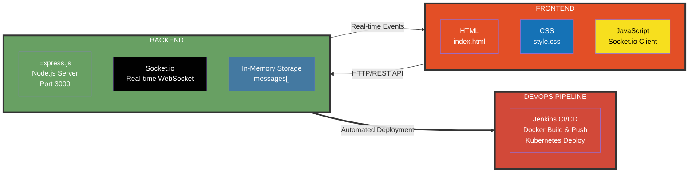

# Stickly App Architecture Diagram

## Technology Stack

### Frontend
- **HTML5**: Modern semantic markup with Apple-inspired design
- **CSS3**: Glassmorphism effects, dark mode, responsive design
- **JavaScript**: Vanilla JS with Socket.io client for real-time updates
- **Features**: Dark mode toggle, search, filtering, animations

### Backend
- **Runtime**: Node.js 20 (Alpine Linux)
- **Framework**: Express.js 4.18.2
- **Real-time**: Socket.io 4.8.1 for WebSocket communication
- **File Upload**: Multer 2.0.2 with memory storage
- **Monitoring**: prom-client 15.1.3 for Prometheus metrics

### Data Storage
- **Type**: In-memory array (no database)
- **Images**: Base64 encoded and stored in memory
- **Persistence**: No persistence (data lost on restart)

### Deployment
- **Containerization**: Docker with multi-stage build
- **Orchestration**: Kubernetes with single replica
- **Service Type**: NodePort (30080)
- **Namespace**: stickly

## Key Features

### Message Management
- Anonymous posting with 500 character limit
- 4 categories with custom animations
- Image support (upload or URL paste)
- Edit messages within 5 minutes
- Edit history tracking
- Admin-only deletion

### Engagement
- Like/unlike functionality
- 5 emoji reactions (😂😢😍🔥👏)
- Nested comment threads (200 char limit)
- Share via Web Share API
- Report system

### Real-time Updates
- Instant message display
- Live like/reaction counts
- Real-time comments
- Active users counter
- Message edit/delete sync

### Admin Features
- Authentication: admin/admin123
- Delete any message
- Session-based admin tracking

## API Endpoints

| Endpoint | Method | Description |
|----------|--------|-------------|
| `/api/messages` | GET | Fetch all messages |
| `/api/messages` | POST | Create new message |
| `/api/messages/:id/like` | POST | Like/unlike message |
| `/api/messages/:id/react` | POST | Add emoji reaction |
| `/api/messages/:id/comments` | GET | Get message comments |
| `/api/messages/:id/comments` | POST | Add comment |
| `/api/messages/:id/edit` | PUT | Edit message (5 min window) |
| `/api/messages/:id` | DELETE | Delete message (admin only) |
| `/upload` | POST | Upload image |
| `/metrics` | GET | Prometheus metrics |

## Monitoring Metrics

- **http_requests_total**: Counter for total HTTP requests
- **http_request_duration_seconds**: Histogram for request duration
- **Default metrics**: CPU, memory, Node.js process metrics
- **Scrape interval**: 15 seconds
